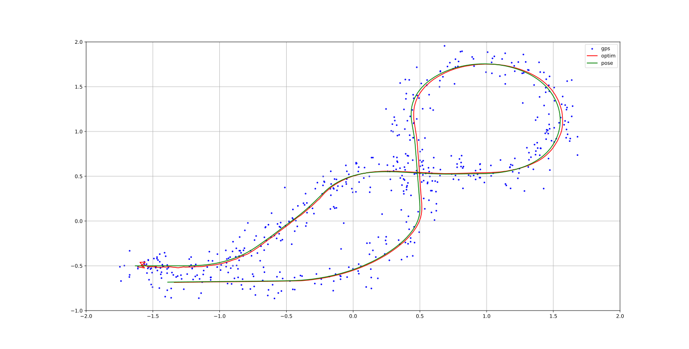

# Factor Graph State Estimation

This repository contains a ROS2 package that enables fusing data from different sensors using factory graph state estimation implemented in [GTSAM library](https://gtsam.org/tutorials/intro.html). The code is adapted to use data from three sensors: GPS, IMU and odometry. That data is used to estimate the position of a mobile robot in a 2D environment. The data passed from the GPS sensor to the algorithm contains the absolute pose of the robot. Due to the susceptibility of data from the IMU and odometry to drift errors, this data is passed to the graph in a form of a relative pose. Graph showing the described relationship is shown below.

```
   gps      gps      gps
    *        *        *
    |  odom  |  odom  |
    O---*----O---*----O
    |        |        |
    |---*----|---*----|
       imu     imu
```

The *turtlebot3_pose_rosbag* file contains a rosbag with recorded data from [TurtleBot3 simulation](https://emanual.robotis.com/docs/en/platform/turtlebot3/simulation/) in Gazebo environment. It stores records from four topics: */pose* (which stands for real pose), */gps_pose*, */odom_relative_pose* and */imu_relative_pose*. Messages from recorded topics are preprocessed, which means that they have a common type [PoseWithCovariance](https://docs.ros.org/en/noetic/api/geometry_msgs/html/msg/PoseWithCovariance.html) (except /pose which uses Pose type without covariance) and they are synchronized to a common rate of 10Hz. The data recorded from each sensor contains noise, which can be represented by a normal distribution. The variances for each sensor are given in the table below.

| Sensor   | Position variance | Orientation variance | 
|:---------|:------------------|:---------------------|
| GPS      | 0.1               | 0.01                 |
| IMU      | 1.0e-05           | 0.001                |
| Odometry | 0.01              | 1.0e-04              |

The picture below shows a vizualization of next GPS measurements (blue points), real path (green line) and estimated poses connected into a continous path (red line).


